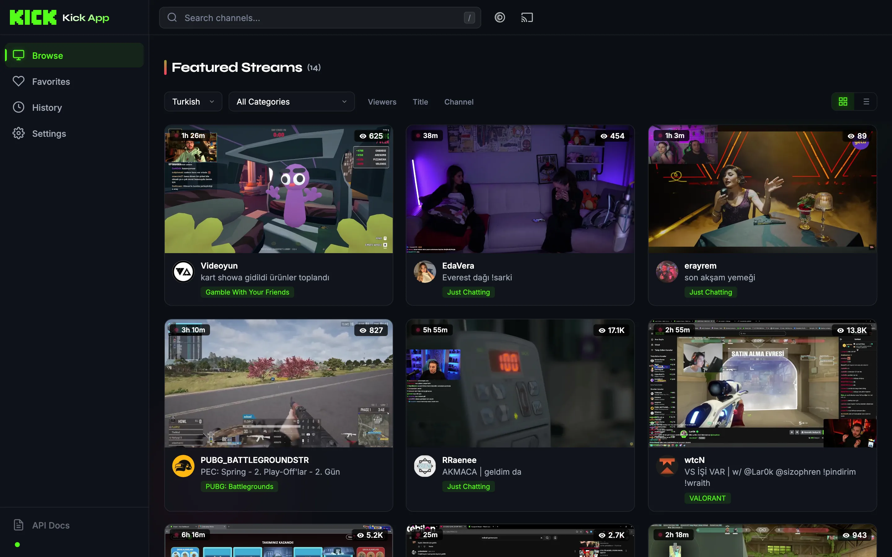
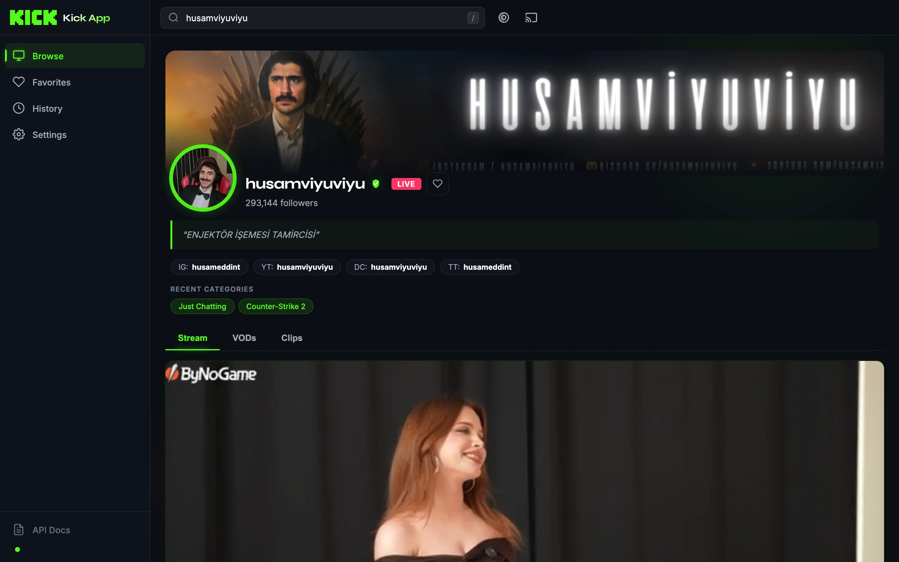

# Unofficial Kick App

<p align="center">
  
</p>

<p align="center">
  <strong>A lightweight, self-hosted Go web app and proxy API for Kick.com streams.</strong>
</p>

<p align="center">
  <code>v4.0.0</code>&ensp;·&ensp;Go 1.24+&ensp;·&ensp;stdlib net/http&ensp;·&ensp;Vanilla JS SPA&ensp;·&ensp;Docker
</p>

<p align="center">
  <a href="https://github.com/orkunevran/UnofficialKickApp/actions/workflows/ci.yml"></a>
  
  <a href="LICENSE"></a>
  
</p>

---

Unofficial Kick App provides a web UI plus a REST API for Kick.com live streams, VODs, clips, featured streams, search, and Chromecast playback. It runs locally, in Docker, or on a small home server such as a Raspberry Pi.

> **Backend:** this app was originally a Python/FastAPI service and was rewritten in **Go** (single static binary, no runtime deps). The HTTP API and frontend are unchanged. The migration plan is in [`docs/MIGRATION_GO.md`](docs/MIGRATION_GO.md); the old Python backend is preserved on the [`legacy/python-backend`](../../tree/legacy/python-backend) branch.

## Features

### Streaming & Playback
- Live stream lookup with HLS playback and quality picker
- Seamless mini-player handoff — live playback keeps running while you browse other channels
- Resizable mini-player video panel with drag-to-resize and double-click expand
- Picture-in-Picture support
- VOD browsing with direct playback redirection
- Recent clip browsing with search filtering
- Chromecast device discovery, fallback subnet probing, cast control, and SSE status streaming

### Discovery & Navigation
- Featured streams with infinite scroll, language and category filtering
- Smart prefetching — next page is cached in the background before you scroll to it
<details>
<summary><strong>Channel page — mobile</strong></summary>
<br />

</details>
- Two-tier channel search: instant local results + full Typesense server-side search with keyboard navigation
- Favorites and History tracking with localStorage persistence
- SPA architecture with hash-based client-side routing and View Transitions

### UI & Design
- System/Light/Dark theme toggle with `prefers-color-scheme` auto-detection
- Atmospheric grain texture overlay and ambient glow orbs
- Syne display typography for headers, Inter for UI text
- Staggered card entrance animations and enhanced hover glow effects
- Glassmorphism surfaces, skeleton loaders, and smooth transitions
- Keyboard shortcuts modal (`?`) with two-key navigation combos (`g b`, `g f`, `g h`, `g s`)
- WCAG AA accessible: skip link, focus rings, ARIA combobox search, tab pattern, `prefers-contrast` and `prefers-reduced-motion` support

### Backend & Operations
- Single static Go binary — embeds all assets via `//go:embed`, no runtime dependencies
- TLS-fingerprint-impersonating Kick client ([`bogdanfinn/tls-client`](https://github.com/bogdanfinn/tls-client)) to pass Cloudflare
- Chromecast via [`vishen/go-chromecast`](https://github.com/vishen/go-chromecast): mDNS discovery + fallback TCP subnet scan
- Per-lane circuit breakers for upstream API resilience
- Stale-while-revalidate caching with in-flight deduplication and negative caching
- Request correlation IDs and structured logging (`log/slog`, text or JSON)
- LRU-bounded in-memory cache with hit/miss stats and max-size eviction
- Batch viewer count endpoint (up to 50 IDs, fanned out in parallel, chunked at 10)
- gzip compression, graceful shutdown, static API docs at `/docs`, metrics at `/metrics`
- Go test suite (unit, contract-parity, and `-race` concurrency tests) + GitHub Actions CI

## Quick Start

### Clone

```bash
git clone https://github.com/orkunevran/UnofficialKickApp.git
cd UnofficialKickApp
```

### Run with Docker

```bash
docker compose up --build
```

The app will be available at `http://localhost:8081`.

> Chromecast mDNS discovery needs host networking. On Linux/Pi, enable
> `network_mode: "host"` in `docker-compose.yaml`; otherwise discovery falls
> back to the subnet scan.

## Local Development

Requires Go 1.24+.

```bash
go run ./cmd/server
# configurable via env, e.g.:
PORT=8081 LOG_LEVEL=DEBUG go run ./cmd/server
```

The app will be available at `http://localhost:8081`. Build a binary with:

```bash
go build -o kick-api ./cmd/server
```

### Running Tests

```bash
go test ./...            # all tests
go test -race ./...      # with the race detector (recommended)
go vet ./...             # static analysis
```

The Go suite covers the framework-independent logic and the HTTP contract:

| Package | Coverage |
| --- | --- |
| `internal/httpapi` (`parity_test.go`) | API contract tests — status codes + exact JSON envelopes for every endpoint, against fake Kick + Chromecast |
| `internal/httpapi` (`concurrency_test.go`) | `-race` guard hammering the shared SWR / inflight / breaker / counter paths |
| `internal/httpapi` (`shutdown_test.go`) | SSE status stream drains on shutdown (graceful-shutdown regression guard) |
| `internal/cache` | LRU eviction, TTL, insertion-order semantics |
| `internal/inflight` | in-flight dedup: waiters, timeout, sweep, claim |
| `internal/breaker` | circuit-breaker state machine, half-open probe |
| `internal/transform` | data transformation edge cases (null-vs-value parity) |
| `internal/kick` | viewer-count / batch / Typesense-merge parsing |

## API Endpoints

### Stream Routes

| Method | Endpoint | Description |
| --- | --- | --- |
| `GET` | `/streams/play/{channel_slug}` | Get live stream data for a channel |
| `GET` | `/streams/go/{channel_slug}` | Redirect to the proxied HLS playlist |
| `GET` | `/streams/m3u8/{channel_slug}.m3u8` | CORS-wrapped HLS master playlist proxy |
<details>
<summary><strong>Channel page — desktop</strong></summary>
<br />

</details>

| Method | Endpoint | Description |
| --- | --- | --- |
| `GET` | `/streams/vods/{channel_slug}` | List VODs for a channel |
| `GET` | `/streams/vods/{channel_slug}/{vod_id}` | Redirect to a specific VOD |
| `GET` | `/streams/clips/{channel_slug}` | List recent clips for a channel |
| `GET` | `/streams/featured-livestreams?language=&page=&category=&subcategory=&sort=&strict=` | Get featured/filtered streams |
| `GET` | `/streams/search?q={query}` | Search Kick channels via Typesense |
| `GET` | `/streams/avatar/{channel_slug}` | Get the channel profile image URL |
| `GET` | `/streams/viewers?id={livestream_id}` | Get current viewer count for a live stream |
| `GET` | `/streams/viewers/batch?ids={id1},{id2},...` | Batch viewer counts (up to 50, chunked at 10) |
| `GET` | `/config/languages` | Get available featured stream languages |

### Chromecast Routes

| Method | Endpoint | Description |
| --- | --- | --- |
| `GET` | `/api/chromecast/devices` | Discover available Chromecast devices |
| `POST` | `/api/chromecast/select` | Select a Chromecast device |
| `POST` | `/api/chromecast/cast` | Start casting a stream |
| `POST` | `/api/chromecast/stop` | Stop or disconnect casting |
| `POST` | `/api/chromecast/{pause,play,volume,seek}` | Playback controls |
| `GET` | `/api/chromecast/last-device` | Get the last connected device |
| `GET` | `/api/chromecast/status` | Get Chromecast connection status |
| `GET` | `/api/chromecast/status/stream` | SSE stream for live Chromecast status updates |

### Operational Routes

| Method | Endpoint | Description |
| --- | --- | --- |
| `GET` | `/health` | Component-level health check (cache, circuit breakers); 200 or 503 |
| `GET` | `/health/live` | Minimal liveness probe (always 200) |
| `GET` | `/metrics` | Cache stats, circuit breaker state, upstream call count, in-flight stats, uptime |
| `GET` | `/docs` | Static API documentation page |

All JSON responses use the envelope `{ "status", "message", "data" }`.

## Architecture

```
cmd/server/main.go          # entrypoint: config, logging, router, graceful shutdown, -healthcheck
assets.go                   # //go:embed static + templates (self-contained binary)
internal/
  config/                   # env-var configuration loader
  httpapi/                  # router (stdlib net/http 1.22 patterns), middleware, handlers:
                            #   streams, chromecast, health, metrics, docs, index;
                            #   SWR + negative caching, correlation IDs, gzip, graceful-shutdown drain
  kick/                     # Kick HTTP client (bogdanfinn/tls-client) + Typesense search w/ key scrape
  chromecast/               # discovery (mDNS + fallback TCP subnet scan), cast control, SSE status poller
  cache/                    # thread-safe in-memory TTL cache with LRU eviction + stats
  inflight/                 # in-flight dedup tracker (thundering-herd guard, SWR claim)
  breaker/                  # circuit breaker (closed / open / half-open)
  transform/                # pure response transformers (channel, VOD, clip, featured)
  obs/                      # upstream call + per-lane circuit-breaker counters (for /metrics)
  logging/                  # slog setup (text/JSON) + repeat-suppressing log throttle
templates/                  # index.html (SPA shell w/ hash-busting), docs.html (API docs)
static/                     # vanilla JS SPA + CSS (see Frontend Architecture)
scripts/deploy-pi.sh        # cross-compile arm64 + deploy/restart the systemd service on the Pi
Dockerfile                  # multi-stage build → distroless static image
```

## Frontend Architecture

The web UI is a vanilla JS Single Page Application with hash-based routing. No build step required. It is served as-is by the Go binary (embedded), unchanged from the original app.

### Rendering Pipeline

The browse view uses three render modes for optimal performance:

| Mode | Trigger | Behavior |
| --- | --- | --- |
| **full** | Initial load, language/category switch, sort | Full DOM replacement with staggered card-enter animations |
| **append** | Scroll-triggered page load | New cards animated in, existing cards untouched |
| **refresh** | 90-second auto-refresh, mid-cycle viewer update | Silent cell-level DOM patching, zero animation overhead |

### Key Design Decisions

- **1-page-ahead prefetch** — after each scroll load, the next page is silently fetched so it is ready instantly when the user scrolls further
- **Page-1-only auto-refresh** — the 90-second timer re-fetches only page 1, keeping API usage minimal
- **Mid-cycle viewer refresh** — at the 60-second mark, batch viewer counts are fetched and animated in-place with eased counting transitions
- **Server-side stale-while-revalidate** — each featured page is cached with a short fresh TTL and a longer stale TTL; stale responses are served instantly while a single background refresh runs
- **Shared-video mini-player handoff** — navigating away from a live channel moves the same persistent `<video>` element into the mini-player instead of recreating playback
- **Observer self-re-triggering** — if the scroll sentinel is still visible after a page loads, the next page loads immediately

### Theme System

Three-state theme (System / Light / Dark) with `prefers-color-scheme` auto-detection, real-time OS change tracking, smooth 300ms CSS transitions, and dynamic `<meta name="theme-color">` / `<meta name="color-scheme">` updates. Accessible via top-bar toggle or `t`.

### Accessibility

WCAG AA: skip-to-content link, `aria-label` on nav landmarks, full combobox ARIA pattern for search, tab ARIA for profile tabs, focusable cards with Enter/Space activation, modal focus trapping with background `inert`, `prefers-contrast: more` and `prefers-reduced-motion: reduce` support, ≥4.8:1 light-theme text contrast, and `rel="noopener noreferrer"` on external links.

## Configuration

Configured via environment variables (or a `.env` file). Variable names match the original app; see [`.env.example`](.env.example).

| Variable | Default | Description |
| --- | --- | --- |
| `DEBUG` | `False` | Enable verbose/dev behavior |
| `PORT` | `8081` | Application port |
| `LOG_LEVEL` | `INFO` | Logging level |
| `LOG_FORMAT_JSON` | `False` | Structured JSON logging for production |
| `DEFAULT_LANGUAGE_CODE` | `tr` | Default featured-stream language |
| `KICK_API_BASE_URL` | `https://kick.com/api/v2/channels/` | Kick channel API base URL |
| `KICK_FEATURED_LIVESTREAMS_URL` | `https://kick.com/stream/featured-livestreams/` | Featured livestreams URL |
| `KICK_ALL_LIVESTREAMS_URL` | `https://kick.com/stream/livestreams/` | Public livestream discovery URL |
| `CACHE_DEFAULT_TIMEOUT` | `300` | Default cache timeout (s) |
| `CACHE_MAX_SIZE` | `2000` | Maximum cache entries before LRU eviction |
| `LIVE_CACHE_DURATION_SECONDS` | `60` | Fresh TTL for live stream data |
| `VOD_CACHE_DURATION_SECONDS` | `300` | Cache duration for VOD and clip data |
| `FEATURED_CACHE_DURATION_SECONDS` | `120` | Fresh TTL for featured streams |
| `FEATURED_STALE_TTL_SECONDS` | `3600` | Stale-while-revalidate window |
| `SEARCH_CACHE_DURATION_SECONDS` | `30` | Cache duration for search results |
| `AVATAR_CACHE_DURATION_SECONDS` | `604800` | Cache duration for avatars (7 days) |
| `VIEWER_CACHE_DURATION_SECONDS` | `30` | Cache duration for viewer counts |
| `NEGATIVE_CACHE_DURATION_SECONDS` | `10` | Short TTL for error responses (404) |
| `CIRCUIT_BREAKER_FAILURE_THRESHOLD` | `5` | Failures before the non-critical breaker opens |
| `CIRCUIT_BREAKER_CRITICAL_FAILURE_THRESHOLD` | `8` | Failures before the critical-lane breaker opens |
| `CIRCUIT_BREAKER_RECOVERY_SECONDS` | `30` | Seconds before half-open probe |
| `CORS_ORIGINS` | `""` | Comma-separated CORS origins (empty = disabled) |
| `CORS_ALLOW_CREDENTIALS` | `False` | Allow credentials in CORS requests |
| `SECURITY_HEADERS_ENABLED` | `True` | Enable security response headers |
| `CHROMECAST_SCAN_TIMEOUT` | `5` | Chromecast discovery timeout |
| `CHROMECAST_SELECT_MAX_RETRIES` | `2` | Max retries for Chromecast connection |
| `CHROMECAST_SELECT_RETRY_DELAY` | `2` | Delay between connection retries |
| `CHROMECAST_DEVICE_CACHE_SECONDS` | `30` | Chromecast device cache lifetime |
| `CHROMECAST_PERIODIC_SCAN_INTERVAL` | `90` | Background scan interval (s) |
| `CHROMECAST_FALLBACK_SCAN_ENABLED` | `True` | Enable subnet probing when mDNS fails |
| `CHROMECAST_FALLBACK_SCAN_SUBNETS` | _(private ranges)_ | Subnets for fallback scanning |
| `CHROMECAST_FALLBACK_SCAN_WORKERS` | `96` | Max concurrent fallback scan workers |
| `CHROMECAST_FALLBACK_SCAN_PROBE_TIMEOUT` | `1.5` | TCP probe timeout during scan (s) |
| `CHROMECAST_FALLBACK_DEVICE_INFO_TIMEOUT` | `3.0` | Device metadata HTTP timeout (s) |

## Deployment

### Raspberry Pi (production)

Production runs the binary directly under **systemd** (`kick-api.service`, `Restart=always`) — not Docker. Deploy with:

```bash
./scripts/deploy-pi.sh            # cross-compile arm64 → rsync into the service dir → systemctl restart → health-check (auto-rollback)
./scripts/deploy-pi.sh --build    # build only
```

An example unit is provided at [`deploy/kick-api.service`](deploy/kick-api.service) — install it once, then the script builds, syncs, restarts, and health-checks. Override `PI_HOST`, `APP_DIR`, `SERVICE`, or `PORT` as needed:

```bash
PI_HOST=pi@192.168.1.50 APP_DIR=/opt/kick-api ./scripts/deploy-pi.sh
```

Logs: `journalctl -u kick-api -f`.

### Docker

```bash
docker build -t kick-api:latest .
docker run -d --name kick-api --restart unless-stopped -p 8081:8081 kick-api:latest
```

The multi-stage build compiles a static binary (stage 1) and ships it on `distroless/static` (stage 2) — a few-MB image with no shell or package manager. `docker build` targets the build platform by default; pass `--platform linux/arm64` (buildx) for the Pi.

## Documentation

- [`docs/architecture.md`](docs/architecture.md) — long-form architecture & runtime data-flow.
- [`docs/MIGRATION_GO.md`](docs/MIGRATION_GO.md) — the Python→Go migration plan and rationale.
- [`docs/KICK_PUBLIC_API.md`](docs/KICK_PUBLIC_API.md) — reverse-engineering memo of Kick's public API surface (confirmed endpoints, search infrastructure, Typesense key extraction, realtime config). The authoritative reference for the upstream endpoints this app depends on.
- [`CONTRIBUTING.md`](CONTRIBUTING.md) — how to build, test, and submit changes.

## Troubleshooting

| Symptom | Fix |
| --- | --- |
| `403`/challenge from Kick | Cloudflare may have tightened fingerprinting — bump the `tls-client` Chrome profile in `internal/kick/client.go` |
| `exec format error` running the image | Built for the wrong arch — rebuild with `--platform` matching the host |
| Chromecast devices do not appear | Needs host networking for mDNS; otherwise the fallback subnet scan must reach the device's subnet |
| Service exits on restart | Fixed — SSE streams now drain on shutdown; check `journalctl -u kick-api` |
| Circuit breaker open (503s) | Check `/metrics` — upstream may be down; the breaker resets after `CIRCUIT_BREAKER_RECOVERY_SECONDS` |
| Stale search results | Typesense key may have rotated — the client auto-refreshes on 401/403 |

## Contributing

Pull requests and issues are welcome. Conventions:

- **Backend**: idiomatic Go, stdlib `net/http`; route layer (`internal/httpapi`) and service layers (`internal/kick`, `internal/chromecast`) stay separate; preserve the `{status, message, data}` envelope, slug validation, and cache-key/TTL intent.
- **Frontend**: vanilla JS ES modules (no build step), rendering via string templates in `static/js/ui.js`.
- **Tests**: `go test -race ./...`; add/adjust tests when behavior changes; keep `gofmt` clean and `go vet` quiet.
- **Style**: CSS custom properties for theming, mobile-first responsive design.
- **Accessibility**: all interactive elements keyboard-focusable with visible focus rings and ARIA attributes.

## License

MIT. See [LICENSE](LICENSE).
