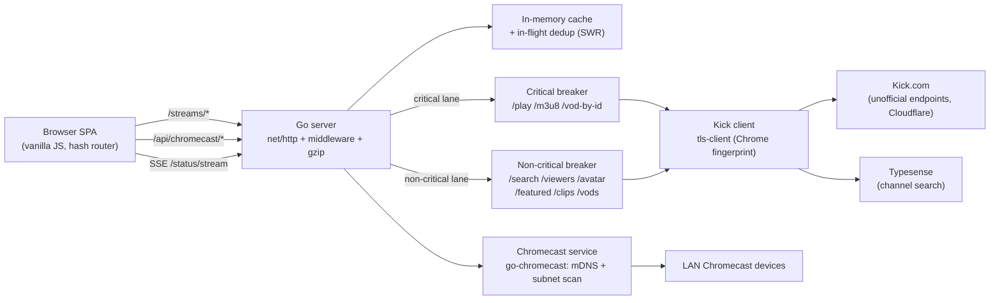

# Architecture

The long-form companion to the README. It maps the modules and explains the
runtime data-flow of the Go server.

## Runtime data-flow



The two-lane circuit breaker is the key reliability invariant: if non-critical
upstream calls (viewer-count polls, search) start failing, the non-critical lane
opens and `/streams/play` keeps working — playback is never blocked by
background-data failures.

## Backend layout

```
cmd/server/main.go        Entrypoint: config, logging, router, background tasks,
                          graceful shutdown, and the -healthcheck subcommand
assets.go                 //go:embed static + templates (self-contained binary)
internal/
  config/                 Env-var configuration with defaults
  httpapi/                Router (net/http 1.22 patterns) + middleware
    server.go             Route table, middleware chain, gzip, BeginShutdown
    middleware.go         Correlation IDs, request timing, security headers
    respond.go            {status, message, data} JSON envelope helpers
    cache_helpers.go      cachedResp + the SWR background-refresh limiter
    streams.go            /play (SWR), /go, /m3u8, /avatar, /clips, /vods,
                          /featured (SWR), /search, /viewers, /viewers/batch;
                          kickCall (per-lane breaker integration), validateSlug
    chromecast.go         /api/chromecast/* endpoints + SSE status stream
    handlers.go           /health, /health/live, /health/ready, /version,
                          /metrics, /config/languages
    render.go             index.html hash-busting; docs page
  kick/                   Kick HTTP client (bogdanfinn/tls-client, Chrome
                          fingerprint) + Typesense search w/ JS-bundle key scrape
  chromecast/             Discovery (mDNS + fallback TCP subnet scan), cast
                          control, shared SSE status poller, known-host LRU
  cache/                  Thread-safe in-memory TTL cache, LRU eviction, stats
  inflight/               In-flight dedup tracker + SWR claim (thundering-herd guard)
  breaker/                Circuit breaker: closed → open → half-open
  transform/              Pure response transformers (channel, VOD, clip, featured)
  obs/                    Upstream + per-lane breaker counters (for /metrics)
  logging/                slog setup (text/JSON) + repeat-suppressing throttle
templates/                index.html (SPA shell), docs.html (API docs page)
```

## Frontend layout

The web UI is a vanilla-JS Single Page Application with hash-based routing.
No build step required — files are embedded and served from `static/`.

```
static/
  Kick_logo.svg                     Top-bar brand mark
  style.css                         Full design system: CSS variables, both
                                    themes, responsive breakpoints
  script.js                         Main entry: router, search, theme, modal
                                    inert mgmt, Safari gesture guard
  js/
    router.js                       Hash-based SPA router with View Transitions
    state.js                        Central app state + preferences (localStorage)
    api.js                          Fetch wrappers with timeout + connection
                                    status tracking
    ui.js                           Card rendering, ARIA, keyboard activation,
                                    grid patching
    player.js                       Mini-player: HLS handoff, slider resize,
                                    expand / collapse
    shortcuts.js                    Keyboard shortcuts: ?, t, g+b/f/h/s, Esc, /
    chromecast.js                   Chromecast modal: discovery, selection,
                                    focus trap
    chromecast_logic.js             Cast-target URL resolver (VOD → manifest)
    toast.js                        Toast notification system (role=alert)
    favorites.js                    Favorites store (localStorage)
    history.js                      Watch-history store (localStorage)
    sorting.js                      Client-side featured-stream sorting
    utils.js                        Escaping, formatting, debounce, clipboard
    views/
      browse.js                     Featured streams: infinite scroll,
                                    1-page-ahead prefetch, 90 s auto-refresh
      channel.js                    Channel profile: HLS player, tabs,
                                    viewer-count refresh
      favorites.js                  Favorites grid with live status fetch
      history.js                    Watch-history list
      settings.js                   Preferences panel (theme, language, view)
  icons/                            UI icons (chromecast, etc.)
```

### Browse-view rendering pipeline

The browse view uses three render modes for performance:

| Mode      | Trigger                                                | Behavior                                        |
| --------- | ------------------------------------------------------ | ----------------------------------------------- |
| `full`    | initial load, language / category switch, sort change  | full DOM replace with staggered card-enter      |
| `append`  | scroll-triggered next page                             | new cards animated in, existing cards untouched |
| `refresh` | 90 s auto-refresh, mid-cycle viewer update             | silent cell-level patching, zero animation cost |

### Notable design decisions

- **Shared-video mini-player handoff** — navigating away from a live channel
  moves the same persistent `<video>` element into the mini-player instead of
  recreating playback.
- **1-page-ahead prefetch** — after each scroll load, the next page is silently
  fetched so it is ready instantly.
- **Page-1-only auto-refresh** — the 90 s timer re-fetches only page 1.
- **Server-side stale-while-revalidate** — featured pages and `/streams/play`
  are cached with a short fresh TTL and a longer stale TTL; stale responses are
  served instantly while a single background refresh runs.

## Key backend patterns

- **In-flight dedup:** on a cold miss only one goroutine fetches; concurrent
  callers wait on a per-key broadcast channel, then read the populated cache.
- **TLS impersonation:** Kick sits behind Cloudflare; the client mimics a Chrome
  TLS/HTTP2 fingerprint so requests aren't challenged.
- **Dual-path Chromecast discovery:** mDNS first; if nothing is found, a bounded
  TCP subnet scan probes port 8009 and resolves device info via eureka_info.
- **Shared SSE poller:** one goroutine polls device status and fans out to all
  SSE subscribers, so N browser connections don't each poll the device.
- **Graceful shutdown:** `BeginShutdown` signals long-lived SSE handlers to
  return so `http.Server.Shutdown` drains promptly (no restart hang).
- **Protected control plane:** Chromecast discovery and mutations require the
  production control token, same-origin browser requests, JSON content types,
  and bounded request bodies; the SPA exchanges the token for an HttpOnly
  SameSite cookie.
- **Production bounds:** semantic cache keys, per-client token-bucket limiting,
  bounded upstream bodies, and systemd resource limits protect the Pi.

## Testing layout

Tests live next to the code they cover (`*_test.go`):

```
internal/httpapi/parity_test.go        contract tests — status + exact JSON envelopes
internal/httpapi/concurrency_test.go   -race guard over SWR / inflight / breaker / counters
internal/httpapi/shutdown_test.go      SSE stream drains on shutdown
internal/cache/cache_test.go           LRU eviction, TTL, insertion order
internal/inflight/inflight_test.go     dedup waiters, timeout, sweep, claim
internal/breaker/breaker_test.go       state-machine transitions, half-open probe
internal/transform/transform_test.go   transformation edge cases (null vs value)
internal/kick/client_test.go           viewer / batch / Typesense-merge parsing
internal/chromecast/chromecast_test.go discovery registry, subnet enumeration, state
```

Contract and concurrency tests drive the real router with in-process fakes for
the Kick client and Chromecast service (no live network). Run with:

```bash
go test -race ./...
```
