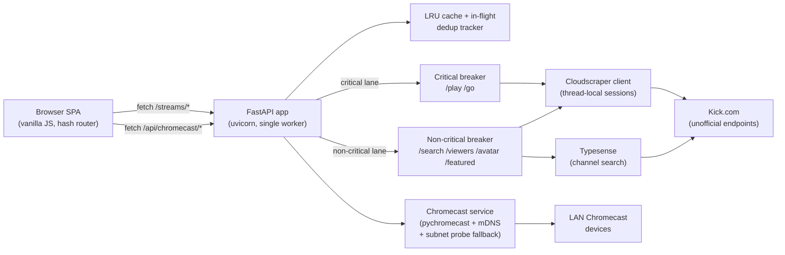

# Architecture

This document is the long-form companion to the README. It maps every module
in the repo and explains the runtime data-flow.

## Runtime data-flow



The two-lane circuit breaker is the key reliability invariant: if non-critical
upstream calls (viewer count polls, search) start failing, the non-critical
lane opens and `/streams/play` and `/streams/go` keep working — playback is
never blocked by background-data failures.

## Backend layout

```
app.py                              FastAPI init, lifespan, middleware, router registration
config.py                           pydantic-settings with env-var validation
api/
  __init__.py
  deps.py                           CacheDep, KickClientDep, ChromecastDep,
                                    CriticalCircuitBreakerDep, NonCriticalCircuitBreakerDep
  middleware.py                     correlation-id + request-timing middleware
  errors.py                         ApiError, success_json / error_json helpers
  schemas.py                        Pydantic request/response models
  cache.py                          InflightTracker, cache_json_response,
                                    cached_value_to_response, dedup_get/set,
                                    claim_inflight (thundering-herd guard for SWR)
  health.py                         /health and /health/live endpoints
  metrics.py                        /metrics endpoint (cache + breaker + uptime)
  chromecast.py                     /api/chromecast/* endpoints + SSE status stream
  routes/
    _common.py                      kick_call (per-lane breaker integration), validate_slug
    channel.py                      /streams/play (SWR), /go, /avatar, /clips
    vods.py                         /streams/vods/{slug}, /streams/vods/{slug}/{id}
    featured.py                     /streams/featured-livestreams (SWR)
    discovery.py                    /streams/search, /streams/viewers, /streams/viewers/batch
services/
  kick_api_service.py               HTTP client for Kick.com (Cloudscraper, thread-local sessions,
                                    Typesense key warm-up at startup)
  cache_service.py                  LRU in-memory cache with max_size and stats
  circuit_breaker.py                Closed → open → half-open state machine
  chromecast_service.py             Device discovery + cast control;
                                    mDNS first, subnet probe as configurable fallback
  transformers.py                   Pure data transformations + cache warm-up
templates/
  index.html                        SPA shell with Jinja2 hash-based cache busting
```

## Frontend layout

The web UI is a vanilla-JS Single Page Application with hash-based routing.
No build step required — files are served straight from `static/`.

```
static/
  Kick_logo.svg                     Top-bar brand mark
  style.css                         Full design system: CSS variables, both
                                    themes, responsive breakpoints
  script.js                         Main entry: router, search, theme, modal
                                    inert mgmt, Safari gesture guard,
                                    iPhone safe-area mini-player gap
  js/
    router.js                       Hash-based SPA router with View Transitions
    state.js                        Central app state + preferences (localStorage)
    api.js                          Fetch wrappers with timeout + connection
                                    status tracking
    ui.js                           Card rendering, ARIA, keyboard activation,
                                    grid patching
    player.js                       Mini-player: HLS handoff, slider resize,
                                    expand / collapse — slider is enabled on
                                    every viewport (mobile-resize support)
    shortcuts.js                    Keyboard shortcuts: ?, t, g+b/f/h/s, Esc, /
    chromecast.js                   Chromecast modal: discovery, selection,
                                    focus trap
    chromecast_logic.js             Cast-target URL resolver (VOD → manifest)
    toast.js                        Toast notification system (role=alert)
    favorites.js                    Favorites store (localStorage)
    history.js                      Watch-history store (localStorage)
    sorting.js                      Client-side featured-stream sorting
    utils.js                        Escaping, formatting, debounce, clipboard
    views/
      browse.js                     Featured streams: infinite scroll,
                                    1-page-ahead prefetch, 90 s auto-refresh
      channel.js                    Channel profile: HLS player, tabs,
                                    viewer-count refresh
      favorites.js                  Favorites grid with live status fetch
      history.js                    Watch-history list
      settings.js                   Preferences panel (theme, language, view,
                                    data clearing)
  art/                              Generative art (p5.js): Signal Drift,
                                    Signal Propagation
  icons/                            UI icons (chromecast, etc.)
```

### Browse-view rendering pipeline

The browse view uses three render modes for performance:

| Mode      | Trigger                                                | Behavior                                           |
| --------- | ------------------------------------------------------ | -------------------------------------------------- |
| `full`    | initial load, language / category switch, sort change  | full DOM replace with staggered card-enter         |
| `append`  | scroll-triggered next page                             | new cards animated in, existing cards untouched    |
| `refresh` | 90 s auto-refresh, mid-cycle viewer update             | silent cell-level patching, zero animation cost    |

### Notable design decisions

- **Shared-video mini-player handoff** — when navigating away from a live
  channel, the same persistent `<video>` element is moved into the mini-player
  instead of recreating playback.
- **1-page-ahead prefetch** — after each scroll load, the next page is silently
  fetched so it is ready instantly.
- **Page-1-only auto-refresh** — the 90 s timer re-fetches only page 1 instead
  of all loaded pages, keeping API usage minimal.
- **Mid-cycle viewer refresh** — at the 60 s mark, batch viewer counts are
  fetched and animated in-place with eased counting transitions.
- **Server-side stale-while-revalidate** — featured pages and `/streams/play`
  are cached with a short fresh TTL and a longer stale TTL; stale responses
  are served instantly while a single background refresh runs.
- **Observer self-re-triggering** — if the scroll sentinel is still visible
  after a page loads, the next page loads immediately without waiting for the
  IntersectionObserver frame delay.

## Testing layout

```
tests/
  conftest.py                       shared fixtures (cache clearing, sample API data)
  test_fastapi_parity.py            contract tests for all API endpoints
  test_transformers.py              data-transformation edge cases
  test_route_helpers.py             slug validation, kick_call, breaker integration
  test_cache_helpers.py             cache-key helpers, route-shared extraction
  test_cache_service.py             LRU eviction, TTL expiry, thread safety
  test_inflight_tracker.py          dedup waiters, timeout, stale sweep
  test_circuit_breaker.py           closed → open → half-open transitions
  test_kick_api_service.py          session thread-safety, Typesense key fallback
  test_chromecast_service.py        device-discovery lifecycle, fallback subnet probe
  test_lifespan.py                  app startup / shutdown sequence
  test_health_and_middleware.py     /health endpoint, security headers
  test_errors.py                    error converter, ApiError mapping
  test_live_latency_guards.py       per-lane breaker isolation, /play SWR,
                                    no-negative-cache for 429 on /play
```

Tests use `monkeypatch` to stub `kick_api_client` and `chromecast_service`
methods, and `httpx.ASGITransport` to make requests directly against the
FastAPI app without a live server.

Run from a Python 3.11+ environment:

```bash
PYTHONPATH=. pytest tests/ -v
```

(Local Python 3.9 cannot import the modules because the codebase uses PEP 604
`X | Y` union syntax. The Pi container runs 3.11.)
